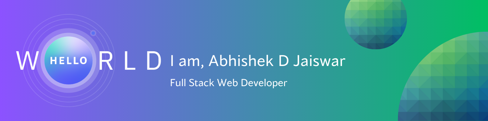

<h1 align="center">Hi, I'm Abhishek Jaiswar 👋</h1>

  

  
  
  
  

---

I build full-stack products that hold up at scale — enterprise dashboards crunching tens of thousands of records, real-time apps wiring together video, chat, and AI in the background, and side projects that go from idea to deployed without losing polish along the way. I care about clean state management, fast UIs, and APIs that behave exactly the way they promise to.

---

### 🛠️ Tech stack

**Languages**
 

**Frameworks & Libraries**
 

**Databases & ORM**
 

**Auth, Real-time & Workflows**
 

**Tools & Platforms**
 

---

🌱 Always learning, always building.

